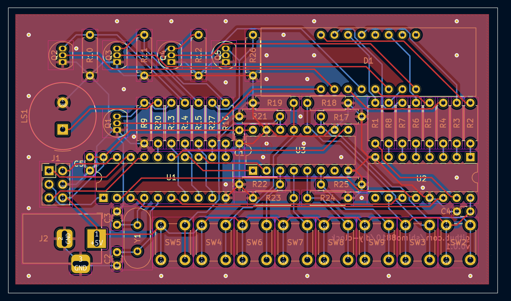
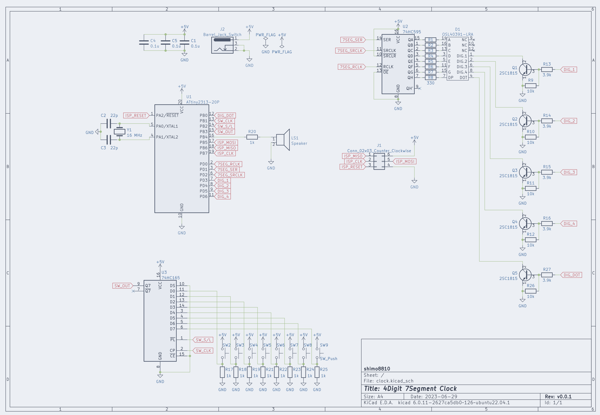

# Rust Board

## Purpose

This project is intended for my personal study and information sharing. The main objectives are as follows:

### Practicing Electronics Circuit

Being a complete novice in circuit design, I created a simple hobby board for the purpose of studying circuit and PCB design.

### Gathering Information on Embedded Rust

The knowledge of developing embedded systems using Rust are scattered, so I wanted to compile information for myself. While there is a wealth of development information available for well-known boards, there is limited knowledge on directly controlling microcontrollers.

## Electronics Circuit






## FirmWare

### connection

In this project, I use FT232RL to write firmware to this board. The connection between FT232RL and the clock's ISP pins should be made according to the table below. Please note that the current version has a design flaw in the ISP pin layout, which deviates from the standard ISP pin configuration. It has become confusing and inconvenient due to this misleading and unfortunate design. Therefore, caution should be exercised.

| FT232RL |    PIN    |
| :-----: | :-------: |
|   CTS   | ISP_MISO  |
|   DCD   | ISP_MOSI  |
|   DSR   |  ISP_SCK  |
|   RI    | ISP_RESET |
|   VCC   |    5V     |
|   GND   |    GND    |

### writing

I use avrdude for writing the firmware. Writing can be performed with the following command. When writing for the first time, it is necessary to configure the fuse settings for attiny2313. Since we are running attiny2313 with an external oscillator (16MHz) and no prescaler, please write with the following settings.

```sh
avrdude -c diecimila \
        -p t2313 \
        -U flash:w:./target/avr-attiny2313/release/blink-attiny2313.elf:e \
        -U lfuse:w:0xff:m
```
